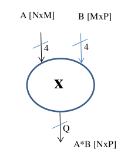

# Electronics Systems Project - VHDL Matrix Multiplier
Electronics Systems course project (MSc in Computer Engineering @ University of Pisa).
The goal of the project is to produce the Design, Simulation and Synthesis of a Matrix Multiplier.\
 
The **VHDL code** was written and tested with ***ModelSim***. Test plans were created using a Python program that generates **Testbench files** for matrices of different sizes and returns their multiplication results. Finally, the **Synthesis logic results** were obtained through the use of the ***Vivado tool***.\
  

## Table of Contents
1. [Programming Languages and Tools](#programming-languages-and-tools)
2. [Project Specifications](#project-specifications)
3. [Project Contents](#project-contents)
  

## Programming Languages and Tools

 
 
 
 

 

## Project Specifications
 Design the VHDL description of a matrix multiplier with the following characteristics: 
- Input matrices of size (NxM) and (MxP) with elements represented in 2’s complement on 4 bits;
- Output matrix of size (NxP) with elements represented in 2’s complement on Q bits. The value of Q has to be determined in order to avoid any finite arithmetic’s error.\
For the test-bench simulation, please consider the following values of the parameters:
N=2, M=3 and P=4.

 
	

 
  

## Project Contents
- **Matrix Multiplier VHDL Source Code**
- **ModelSim Project of a Matrix Multiplier**
- **Vivado Project of Matrix Multiplier Synthesis and Implementation**
- **Python Program for testbench files dynamic generation**
- **Project Report**
